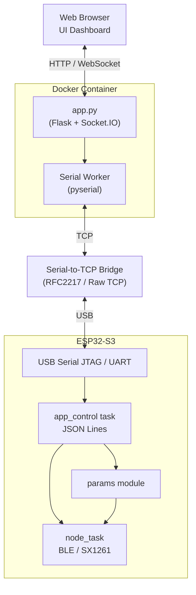

```mermaid
flowchart TB

UI["Web Browser<br/>UI Dashboard"]

subgraph Docker["Docker Container"]
    APP["app.py<br/>(Flask + Socket.IO)"]
    SERIAL["Serial Worker<br/>(pyserial)"]
    APP --> SERIAL
end

BRIDGE["Serial-to-TCP Bridge<br/>(RFC2217 / Raw TCP)"]

subgraph ESP32["ESP32-S3"]
    USB["USB Serial JTAG / UART"]
    CONTROL["app_control task<br/>JSON Lines"]
    NODE["node_task<br/>BLE / SX1261"]
    PARAMS["params module"]

    USB --> CONTROL
    CONTROL --> NODE
    CONTROL --> PARAMS
    PARAMS --> NODE
end

UI <-->|"HTTP / WebSocket"| APP
SERIAL <-->|"TCP"| BRIDGE
BRIDGE <-->|"USB"| USB

```
